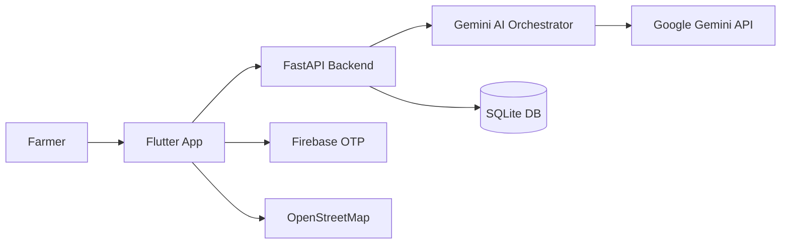

# 📐 KissanAI – High‑Level Design Overview

## 1️⃣ Brief System Overview
KissanAI is a **mobile‑first agricultural marketplace** that connects **farmers** with **machinery operators**. The app is built with **Flutter** (frontend) and a **FastAPI** backend that runs on **Hugging Face Spaces**.  Business‑logic is driven by **Google Gemini** agents (provided by the Antigravity orchestrator) which perform NLP, matching, pricing, scheduling, notification and dispute resolution.

---

## ## 2️⃣ Architecture Diagram

---

## 3️⃣ Key Components
| Layer | Component | Role |
|------|-----------|------|
| **Frontend** | `ApiService` (Dio) | Central HTTP client, injects base URL, handles JWT storage. |
| | `BookingProvider` (Provider) | State‑management for bookings, calls backend endpoints (`/voice-match`, `/text-match`, `/booking/...`). |
| | `AudioRecorder` | Records short WAV clips, sends to backend for voice‑based booking. |
| | `flutter_map` + OSM | Shows live GPS tracking of operators. |
| **Backend** | `main.py` (FastAPI) | Exposes REST API (`/api/auth/*`, `/api/booking/*`, `/api/tracking/*`). |
| | `auth.py` | JWT generation/validation, Firebase token verification. |
| | `booking.py` | Receives voice/text payload, forwards to Gemini orchestrator, persists booking in SQLite. |
| | `tracking.py` | WebSocket endpoint that streams operator GPS to the mobile client. |
| **Database** | `kissanai.db` (SQLite) | Stores users, bookings, provider availability, dispute records. |
| **AI Layer** | **Antigravity Orchestrator** (custom Python module) | Coordinates **six** Gemini agents:
   - **ZabaanAI** – multilingual (Urdu/English) speech‑to‑text + intent extraction.
   - **AgriComplex AI** – classifies booking urgency & complexity.
   - **SmartMatch AI** – ranks operators using rating + availability.
   - **FairPrice AI** – calculates dynamic PKR price based on market rates, urgency, operator experience.
   - **ScheduleMind AI** – checks time‑slot conflicts and proposes alternatives.
   - **ResolveAI** – dispute analysis & settlement suggestion.
| **External Services** | **Firebase Auth** | Phone‑OTP verification, token exchange for JWT. |
| | **Google Gemini API** | Large‑language‑model calls used by the six agents. |
| | **OpenStreetMap** | Tile server for map view (no API key needed). |
---

## 4️⃣ API Overview
### 4.1 Public (Mobile ↔ Backend) Endpoints
| Method | Path | Description | Real / Mock |
|--------|------|-------------|------------|
| `POST` | `/api/auth/login_local` | Login with phone number → returns JWT. | **Real** (FastAPI) |
| `POST` | `/api/auth/register_local` | Register new user (farmer/operator). | **Real** |
| `POST` | `/api/booking/voice_match` | Upload WAV, triggers AI pipeline. | **Real** |
| `POST` | `/api/booking/text_match` | Send plain‑text booking request. | **Real** |
| `GET` | `/api/booking/{id}` | Fetch booking details + timeline. | **Real** |
| `GET` | `/api/tracking/stream` (WebSocket) | Live GPS updates of assigned operator. | **Real** |
| `POST` | `/api/booking/{id}/dispute` | Submit dispute, get settlement suggestion. | **Real** |
| `GET` | `/api/operator/availability` | List of available operators. | **Real** |
| `PATCH` | `/api/operator/{id}/location` | Update operator GPS (called by operator app). | **Real** |

### 4.2 Internal (Backend ↔ Gemini) Calls
| Agent | Endpoint | Purpose |
|-------|----------|---------|
| `ZabaanAI` | `POST https://generativeai.googleapis.com/v1beta/models/gemini-pro:generateContent` | Speech‑to‑text + intent extraction. |
| `AgriComplex AI` | same Gemini endpoint | Classify urgency / complexity. |
| `SmartMatch AI` | same Gemini endpoint | Rank operators based on DB data. |
| `FairPrice AI` | same Gemini endpoint | Compute price using market factors. |
| `ScheduleMind AI` | same Gemini endpoint | Conflict detection & slot suggestion. |
| `ResolveAI` | same Gemini endpoint | Dispute analysis & settlement. |

All six agents share the same **Gemini model** but are invoked with distinct system prompts (provided in `agents/` folder). The orchestrator pipes the request/response through the appropriate prompt and returns a structured JSON payload to the FastAPI handler.
---

## 5️⃣ Agents Developed (Antigravity Sub‑agents)
| Agent Name | Prompt Focus | Output Schema |
|------------|--------------|---------------|
| **ZabaanAI** | *“You are a multilingual agricultural assistant. Convert Urdu/English voice transcript into a JSON with fields `service_type`, `location`, `urgency`, `requested_time`.”* | `{service_type:string, location:string, urgency:string, requested_time:string}` |
| **AgriComplex AI** | *“Classify the booking complexity: `standard`, `high_urgency`, `heavy_machinery` and compute a numeric `risk_score` (0‑100).”* | `{complexity:string, risk_score:int}` |
| **SmartMatch AI** | *“Given a location and service_type, return the top 3 operator IDs with rating and distance.”* | `{matches:[{operator_id:int, rating:float, distance_km:float}]}` |
| **FairPrice AI** | *“Calculate the price in PKR using base_rate, urgency surcharge, operator experience premium.”* | `{price_pkrs:float, breakdown:{base:float, urgency:float, premium:float}}` |
| **ScheduleMind AI** | *“Check the requested slot against existing bookings and either confirm or suggest the next free slot.”* | `{status:string, confirmed_time:string, alternative_time?:string}` |
| **ResolveAI** | *“Analyze a dispute, consider operator rating and delay, output a settlement amount and apology text.”* | `{settlement_pkrs:float, apology:string, confidence:float}` |
---

## 6️⃣ Integration Flow (Step‑by‑Step)
1. **User opens the app** → Flutter loads `ApiService` with `baseUrl` (environment variable).  
2. **Login** → Phone number sent to Firebase, OTP verified, JWT stored locally.  
3. **Booking request** (voice or text) → Provider calls `/api/booking/*`.  
4. **Backend** receives payload, validates JWT, stores a *raw* request entry.  
5. **Orchestrator** runs the six Gemini agents sequentially, each returning JSON.  
6. Results are **merged** into a single `BookingResponse` object, persisted, and the status is set to `confirmed`.  
7. **Notification** – the orchestrator builds a Roman‑Urdu SMS and calls Firebase Cloud Messaging (future extension).  
8. **Operator app** polls `/api/operator/{id}/location` or receives WebSocket updates → live pin on map.  
9. **Dispute** → farmer posts to `/api/booking/{id}/dispute`, orchestrator runs `ResolveAI`, returns settlement.  
10. **All actions** are logged in the SQLite DB and can be visualised via the **Trace Timeline** screen (shows each AI step for transparency).
---

## 7️⃣ Mock vs Real API Usage (Testing)
| Layer | Mock Implementation | When Used |
|------|--------------------|-----------|
| **Frontend** | `lib/services/mock_api_service.dart` (returns static JSON) | Unit tests, CI pipelines where external network is unavailable. |
| **Backend** | `backend/tests/mock_gemini.py` (stubs Gemini responses) | Backend unit tests, CI. |
| **Firebase** | `firebase_mocks.dart` (simulated OTP) | Local dev on machines without internet. |
| **Hugging Face** | Not mocked in production – only for live deployment. |
---

## 8️⃣ Extensibility Points
- **Add new service types** – extend `ZabaanAI` prompt and add DB schema rows.  
- **Swap Gemini model** – change the model name in `config.py`.  
- **Push notifications** – integrate Firebase Cloud Messaging in the orchestrator.  
- **Multi‑language support** – add additional language prompts to `ZabaanAI`.  
- **Operator app** – a separate Flutter module can reuse the same API endpoints.
---

### TL;DR
- **Flutter** UI ↔ **FastAPI** (HF Space) via HTTPS.  
- **SQLite** for persistence.  
- **Google Gemini** powers six specialized agents.  
- **Firebase** handles phone‑OTP authentication.  
- **Internet permission** and correct API URL are required for the release APK.  
- Full flow documented in `kissanai_flow.md` and `kissanai_deployment_guide.md`.

---

**End of design overview**
