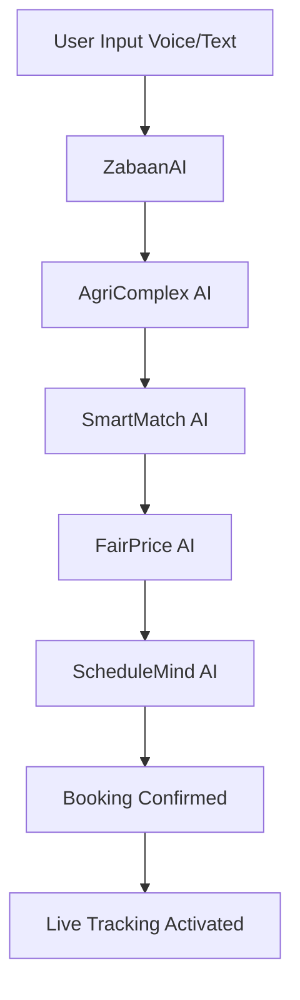
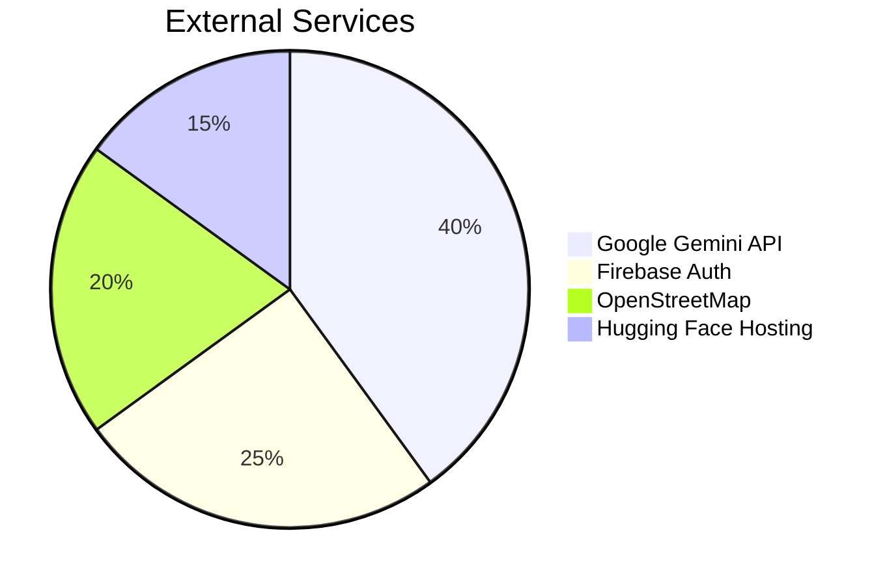
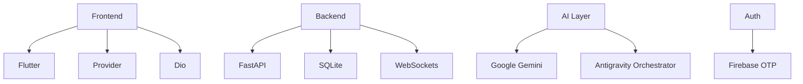

Check out the configuration reference at https://huggingface.co/docs/hub/spaces-config-reference

# 🌾 KissanAI – High-Level System Design

**Built by:** Ramsha Noshad & Urooj Sadik  

---

## 🚀 Overview

KissanAI is a **mobile-first agricultural marketplace** that connects farmers with machinery operators using an **AI-powered orchestration system**.

It supports:
- 📱 Voice + Text booking
- 🤖 AI matching, pricing, scheduling
- 📍 Live GPS tracking
- 🔐 Firebase authentication
- ☁️ FastAPI backend (Hugging Face Spaces)

---

## 🏗️ System Architecture

```mermaid
flowchart LR
    Farmer[👨‍🌾 Farmer] --> App[📱 Flutter App]
    App --> API[☁️ FastAPI Backend]
    API --> AI[🤖 AI Orchestrator]
    AI --> Gemini[🧠 Google Gemini API]
    AI --> DB[(🗄️ SQLite Database)]
    API --> Track[📍 Live Tracking]
    Track --> Operator[🚜 Operator]
````

---

## 🧠 AI Agent Distribution

```mermaid
pie title AI Workload
    "ZabaanAI (Voice Processing)" : 20
    "SmartMatch AI (Matching)" : 20
    "FairPrice AI (Pricing)" : 15
    "ScheduleMind AI (Scheduling)" : 15
    "AgriComplex AI (Risk Analysis)" : 15
    "ResolveAI (Disputes)" : 15
```

---

## 🔄 Booking Flow



---

## 📊 API Usage Overview

| Module         | Usage |
| -------------- | ----- |
| Authentication | 25%   |
| Booking System | 45%   |
| Tracking       | 20%   |
| Disputes       | 10%   |

---

## 🔌 External Integrations



---

## 🏗️ Tech Stack



---

## 🧠 Summary

KissanAI is an **AI-driven agricultural ecosystem** where:

* Farmers book machinery using voice/text
* AI handles matching, pricing, scheduling
* GPS tracking ensures transparency
* Firebase secures authentication
* FastAPI + Gemini power intelligence layer

---

## 👩‍💻 Authors

Ramsha Noshad
Urooj Sadik


Just tell 👍
```
